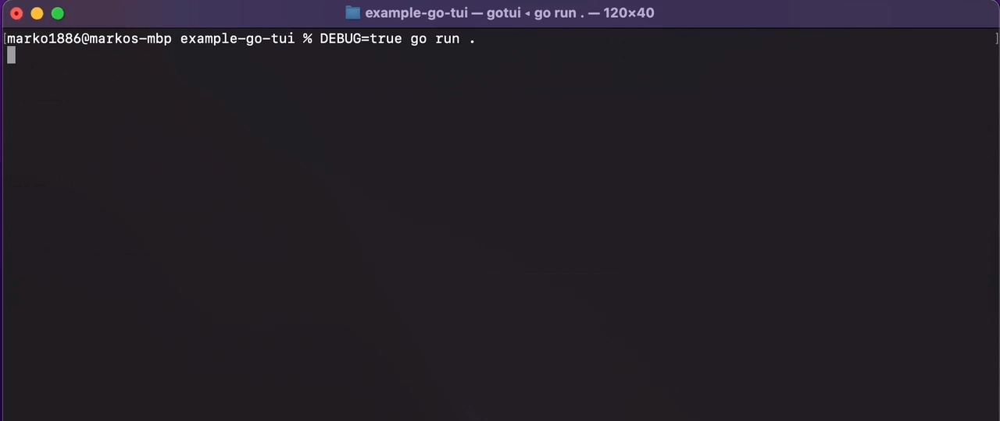

# example-go-tui

Example TUI (terminal UI) application written in Go for showing off functionality with the use of
[bubbletea](https://github.com/charmbracelet/bubbletea).

**Application requirements:**
- Retrieve the user from the database and store it
- Use the stored user to retrieve it's token

**Style requirements:**
- Have a list of commands which we can run
- Display the status of the app, the user stored and any errors
- The token command is disabled until we retrieve the user
- Add a loading spinner for lengthy actions



## Setup

Ensure to start the database with docker
```bash
docker compose up -d
```

For debugging of logs set the environment variable
```bash
DEBUG=true go run .
```

## Useful articles and docs

[Blog - commands in bubble tea](https://charm.sh/blog/commands-in-bubbletea/)

[Bubble tea examples](https://github.com/charmbracelet/bubbletea/blob/master/examples/realtime/main.go)